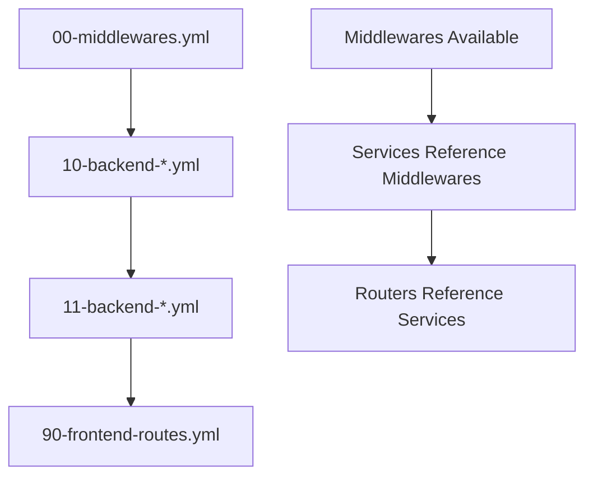
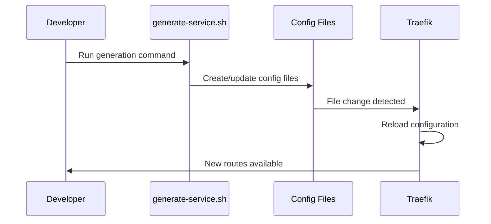

# Traefik Service Management Architecture

Hướng dẫn chi tiết về cách tổ chức và quản lý services trong Traefik với naming convention và automation scripts.

## 📁 File Organization Structure

### Tổng quan
```
traefik/
├── traefik.yml                   # Static configuration 
├── dynamic/                      # Dynamic configurations (auto-reload)
│   ├── 00-middlewares.yml       # Shared middlewares
│   ├── 10-backend-cam.yml       # Camera service backend
│   ├── 11-backend-chat.yml      # Chat service backend  
│   ├── 12-backend-blog.yml      # Blog service backend
│   └── 90-frontend-routes.yml   # All frontend routing
```

### Load Order và Numbering Convention

**Tại sao cần đánh số?**
- Traefik load các file theo **alphabetical order**
- Dependencies phải load trước khi được reference
- Consistent organization cho team development

## 🔢 Numbering Scheme

### Category-based Ranges

| Range | Category | Purpose | Example |
|-------|----------|---------|---------|
| **0x (00-09)** | Core/Shared | Middlewares, global configs | `00-middlewares.yml` |
| **1x (10-19)** | Backend Services | API containers | `10-backend-cam.yml` |
| **9x (90-99)** | Frontend Routes | Vercel/static frontends | `90-frontend-routes.yml` |

### Load Order Logic


**Sequence:**
1. **Middlewares** load first (00-09)
2. **Backend services** load next (10-19) 
3. **Frontend routes** load last (90-99)

## 🏷️ Domain Naming Convention

### Frontend Applications (Main domains)
```bash
cam.thanhpt.xyz         # Camera web app
chat.thanhpt.xyz        # Chat application  
blog.thanhpt.xyz        # Blog website
admin.thanhpt.xyz       # Admin dashboard
```

### Backend APIs (Subdomain with -api suffix)
```bash
cam-api.thanhpt.xyz     # Camera API endpoints
chat-api.thanhpt.xyz    # Chat API endpoints
blog-api.thanhpt.xyz    # Blog API endpoints  
admin-api.thanhpt.xyz   # Admin API endpoints
```

### Special Services
```bash
dashboard.thanhpt.xyz   # Traefik dashboard
whoami.thanhpt.xyz      # Test/debug service
```

## 📋 File Content Structure

### 1. Shared Middlewares (00-middlewares.yml)
```yaml
http:
  middlewares:
    securityHeaders:        # Security cho tất cả services
    rateLimit:             # Rate limiting
    gzip:                  # Compression  
    corsApi:               # CORS cho APIs (restrictive)
    corsPublic:            # CORS cho public APIs
```

### 2. Backend Services (1x-backend-*.yml)
```yaml
http:
  services:
    service-name-api:      # Backend service definition
      loadBalancer:
        servers:
          - url: "http://container-name:port"
  
  routers:
    service-name-api:      # API router
      rule: "Host(`service-api.thanhpt.xyz`)"
      service: service-name-api
      middlewares:         # Reference shared middlewares
        - corsApi
        - securityHeaders
        - rateLimit
```

### 3. Frontend Routes (90-frontend-routes.yml)
```yaml
http:
  services:
    service-name-frontend: # Frontend service (Vercel)
      loadBalancer:
        servers:
          - url: "https://app.vercel.app"
  
  routers:
    service-name-frontend: # Frontend router
      rule: "Host(`service.thanhpt.xyz`)"
      service: service-name-frontend
      middlewares:
        - securityHeaders
        - gzip
```

## 🚀 Automation với Generate Script

### Script Overview: `cli/generate-service.sh`

Automation script để tạo service configurations tự động.

### Usage Examples

#### 1. Backend API Only
```bash
./cli/generate-service.sh -n chat -t api -p 3001
```
**Kết quả:**
- Tạo file: `11-backend-chat.yml`
- Domain: `chat-api.thanhpt.xyz → chat-api:3001`
- Auto-connect container đến `jarvis-proxy` network

#### 2. Frontend Only  
```bash
./cli/generate-service.sh -n blog -t frontend -u https://blog-app.vercel.app
```
**Kết quả:**
- Append vào: `90-frontend-routes.yml`
- Domain: `blog.thanhpt.xyz → https://blog-app.vercel.app`

#### 3. Full Stack (API + Frontend)
```bash
./cli/generate-service.sh -n admin -t both -p 4000 -u https://admin.vercel.app
```
**Kết quả:**
- Tạo file: `12-backend-admin.yml` (API)
- Append vào: `90-frontend-routes.yml` (Frontend)
- Domains: 
  - `admin-api.thanhpt.xyz → admin-api:4000`
  - `admin.thanhpt.xyz → https://admin.vercel.app`

### Script Parameters

| Parameter | Description | Example |
|-----------|-------------|---------|
| `-n, --name` | Service name | `chat`, `blog`, `admin` |
| `-t, --type` | Service type | `api`, `frontend`, `both` |
| `-p, --port` | Backend port | `3001`, `8080`, `4000` |
| `-u, --url` | Frontend URL | `https://app.vercel.app` |
| `-h, --help` | Show help | |

## 🔄 How Auto-reload Works

### Traefik Configuration
```yaml
# traefik.yml
providers:
  file:
    directory: /etc/traefik/dynamic/  # Watch entire directory
    watch: true                      # Enable auto-reload
```

### Workflow


## 🛡️ Security & CORS Configuration

### API Services (Restrictive)
```yaml
corsApi:
  headers:
    accessControlAllowOrigin: "https://*.thanhpt.xyz"  # Only own domains
    accessControlAllowCredentials: true
```

### Public APIs (Permissive)  
```yaml
corsPublic:
  headers:
    accessControlAllowOrigin: "*"                      # All origins
    accessControlAllowMethods: ["GET", "OPTIONS"]      # Read-only
```

### Rate Limiting
```yaml
rateLimit:
  rateLimit:
    average: 100    # 100 requests/second average
    burst: 20       # Allow burst up to 120 rq/s
```

## 📊 Scalability Benefits

### ✅ Advantages

1. **Separation of Concerns**
   - Backends: Individual files
   - Frontends: Shared file  
   - Middlewares: Shared configuration

2. **Predictable Load Order**
   - Dependencies load before dependents
   - No circular reference issues

3. **Easy Maintenance**
   - Add/remove services without affecting others
   - Clear file naming convention
   - Automated generation

4. **Team Collaboration**
   - Each backend service = separate file
   - Merge conflicts minimized
   - Clear ownership boundaries

### 📈 Growth Pattern
```bash
# Starting point
00-middlewares.yml
10-backend-cam.yml
90-frontend-routes.yml

# After scaling
00-middlewares.yml
10-backend-cam.yml
11-backend-chat.yml
12-backend-blog.yml  
13-backend-admin.yml
14-backend-api-gateway.yml
90-frontend-routes.yml
```

## 🔧 Troubleshooting

### Common Issues

1. **Services not loading**
   - Check file naming (must end with `.yml`)
   - Verify YAML syntax with `yq eval file.yml`
   - Check Traefik logs: `docker logs traefik`

2. **CORS errors**
   - Verify middleware configuration
   - Check domain matching in `corsApi` settings
   - Test with browser dev tools

3. **502 Bad Gateway**
   - Verify container is running
   - Check network connectivity: `docker network inspect jarvis-proxy`
   - Test internal connection: `docker exec traefik curl http://service:port`

### Debug Commands
```bash
# Check Traefik configuration
docker logs traefik --tail 50

# Test service connectivity  
docker exec traefik curl http://service-name:port

# Verify network setup
docker network inspect jarvis-proxy

# Validate YAML syntax
yq eval traefik/dynamic/file.yml
```

## 🎯 Best Practices

1. **File Naming**
   - Use category-based numbering
   - Descriptive names: `backend-servicename`
   - Consistent extensions: `.yml`

2. **Service Naming**
   - Container names: `servicename-api`
   - Domain convention: `servicename-api.thanhpt.xyz`
   - Consistent patterns across all services

3. **Documentation**
   - Comment configurations clearly
   - Document custom middlewares
   - Keep this guide updated

4. **Testing**
   - Test locally before deploying
   - Verify CORS settings
   - Check rate limiting behavior

---

## 📚 References

- [Traefik File Provider Documentation](https://doc.traefik.io/traefik/providers/file/)
- [Traefik Middleware Documentation](https://doc.traefik.io/traefik/middlewares/overview/)
- [Docker Networking Guide](https://docs.docker.com/network/)

---

*Last updated: June 2024*  
*Author: Jarvis Proxy Team* 